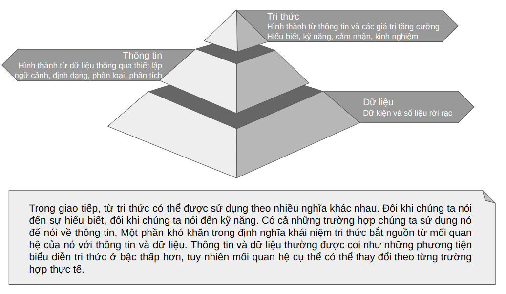

# Định nghĩa dữ liệu, thông tin, tri thức

## Nội dung
1. [Dữ liệu](#dữ-liệu)
2. [Thông tin](#thông-tin)
3. [Tri thức](#tri-thức)  
    3.1. [Tri thức ẩn và tri thức tường minh](#tri-thức-ẩn-và-tri-thức-tường-minh)  
    3.2. [Vốn trí tuệ](#vốn-tri-tuệ)  
    3.3. [Vốn tri thức](#vốn-tri-thức)  
    3.4. [Quản trị tri thức](#quản-trị-tri-thức)
4. [Các định nghĩa khác](#các-định-nghĩa-khác)
5. [Tham khảo](#tham-khảo)

_Trong Quản Trị Tri Thức (Knowledge Management / KM) phân biệt các khái niệm "Tri thức", "Thông tin" và "Dữ liệu" có ý nghĩa rất quan trọng. Trong bài viết này, chúng ta sẽ cùng khám phá 1 mô hình tương đối phổ biến, trong đó dữ liệu, thông tin, và tri thức được tổ chức thành 1 cấu trúc phân cấp hình kim tự tháp._

## Dữ liệu

Dữ liệu có thể chỉ đơn giản là các tín hiệu, các bít, các con số, dữ kiện, hình ảnh, số liệu. Chúng rời rạc, độc lập, và trong điều kiện cô lập không hàm chứa ý nghĩa. Dữ liệu giống như những mảnh ghép mà chúng ta có thể sử dụng để tổ chức thành thông tin. Dữ liệu có thể là giá trị của phép đo, kết quả của phép tính. Dữ liệu cũng có thể là các dữ kiện chưa được xử lý, chưa được sắp xếp. 

Tất cả các tổ chức đều cần dữ liệu,  và có những tổ chức mà các hoạt động của nó gắn chặt với dữ liệu. Điển hình như các công ty bảo hiểm, ngân hàng, v.v.., với hàng triệu giao dịch được xử lý hàng ngày. Quá nhiều dữ liệu có thể gây ra khó khăn trong đánh giá tình hình và lựa chọn hành động trước khi hoàn thành phân tích dữ liệu. Mỗi tổ chức cần xác định bản chất và dung lượng dữ liệu cần thiết để tạo thông tin cho mình.

## Thông tin

Từ thông tin thường được sử dụng tương đương với từ information. Trong tiếng Anh information có gốc là inform - có 1 nghĩa là "định hình cho". Như vậy có thể hiểu information hay thông tin có tác động định hình đối với thế giới quan của đối tượng tiếp nhận, hoặc ngắn gọn là có ý nghĩa đối với đối tượng tiếp nhận. Thông tin là tổ hợp dữ liệu có khả năng hỗ trợ ra quyết định. Thông tin còn là dữ kiện và số liệu dựa trên dữ liệu đã được tái định dạng hoặc đã được xử lý.

Khác với dữ liệu, thông tin có ý nghĩa, mục đích và tính phù hợp. Nó có hình trạng bởi vì nó được tổ chức cho mục đích. Trong khi dữ liệu nhấn mạnh số lượng và tính hiệu quả của tiến trình, thì thông tin tập trung vào chất lượng. Dữ liệu trở thành thông tin khi mà ý nghĩa hoặc giá trị được thêm vào làm tăng chất lượng ra quyết định.

## Tri thức

Khi thông tin được đặt trong ngữ cảnh tri thức sẽ cho chúng ta biết hành động cần thực hiện. Tri thức là liệu pháp thần kỳ nhất để hóa giải sự phức tạp và không chắc chắn. Nó là thượng tầng khái quát trong trí tuệ con người. Nó rộng hơn, dày hơn, và khó nắm bắt hơn rất nhiêu so vơi dữ liệu hoặc thông tin. Con người theo đuổi tri thức bởi vì nó giúp họ thành công. Tri thức có tính động, đúng định dạng, đúng thời điểm, và đúng vị trí để thành công. Có 1 điều quan trọng cần lưu ý rằng tri thức có nhiều nghĩa khác nhau phụ thuộc vào lĩnh vực nơi nó được sử dụng. Trong ngữ cảnh quản trị tri thức, tri thức là "hiểu biết của người về 1 lĩnh vực chuyên môn cụ thể thu được qua học tập và trải nghiệm". Theo đó, nó là kết quả của việc làm giàu thông tin bằng kinh nghiệm được tạo ra trong tiến trình kiểm nghiệm theo thời gian. Nó dựa trên học tập, tư duy, và tiếp xúc với lĩnh vực ứng dụng trong phạm vi 1 phòng ban, chi nhánh, hoặc trong toàn công ty. Trọng tâm được dồn về ưu thế cạnh tranh bền vững.

Tri thức không phải thông tin và thông tin không phải dữ liệu. Tri thức được đúc kết từ thông tin theo cùng cách mà thông tin được đúc kết từ dữ liệu. Nó có thể được coi như hiểu thông tin dựa trên cảm nhận về tính quan trọng hoặc tính phù hợp của thông tin đối với lĩnh vực ứng dụng. Nó cũng có thể được coi như phạm vi thông tin của người. Bao phủ 1 không gian rộng hơn thông tin, tri thức bao gồm cả cảm nhận, kỹ năng, rèn luyện, thị hiếu, và kinh nghiệm. Nó là tổng hòa của tiến trình nhận thức của chúng ta và giúp chúng ta đưa ra những kết luận có ý nghĩa.

Tri thức đã luôn là thành phần thiết yếu trong sự phát triển của nhân loại. Loài người sử dụng tri thức của họ để tạo ra những sản phẩm và dịch vụ với giá trị tăng cường để chiếm ưu thế trong cạnh tranh.

Hành động, hoặc khả năng hành động chính là thứ khiến cho tri thức có giá trị. Đó cũng là tiêu chí quan trọng nhất đối với tri thức trong 1 tổ chức. Bạn cần tri thức nào cho hành động nào? Bạn sử dụng tri thức cho các hành động như thế nào? Các hành động sẽ là đúng đắn? Đại ý là, năng lực đặc biệt quan trọng mà tri thức đem lại cho bạn là gì?

Một khía cạnh quan trọng của tri thức là tính cụ thể, có nghĩa là nó không thể được chuyển giao tự do từ 1 lĩnh vực ứng dụng này sang 1 lĩnh vực ứng dụng khác. Bác sỹ phẫu thuật tim mạch biết cách chữa bệnh hở van tim, người thợ cơ khí chuyên về hộp số biết cách sửa bánh răng số lùi, và người họa sĩ biết cách tạo ra bức tranh chân dung tuyệt đẹp. Những tri thức đó được gọi là tri thức ẩn và thường mất nhiều năm để lĩnh hội.

> ! Đừng để bản thân bị rơi vào cái bẫy cố gắng phân tách mọi thứ là dữ liệu, thông tin, hay tri thức.  Mọi người đều có thể thiết lập ngữ cảnh riêng và  quyết định cái gì là cái gì. Thông tin của tôi có thể là tri thức của bạn trong khi đó tri thức của bạn có thể là thông tin của tôi...

### Tri thức ẩn và tri thức tường minh

Tri thức ẩn và tri thức tường minh là 2 khái niệm quan trọng khác cần phân biệt trong quản trị tri thức.

**Tri thức tường minh** có thể được nói ra, được viết xuống, và được truyền đi. Nó có tính chất khách quan, chứa đựng trong các luật và các định nghĩa. Nó có thể dễ dàng được thu thập, lưu trữ, và truyền đi bằng các phương tiện kỹ thuật. Hầu như tri thức tường minh là những gì chúng ta biết và có thể diễn tả bằng lời. Tri thức tường minh bao gồm những thứ chúng ta biết và chúng ta có thể ghi chép lại, chia sẻ với người khác, và đưa vào cơ sở dữ liệu. Ví dụ như công thức làm món cá rán. Các bước làm món cá rán có thể được mô tả chi tiết, bao gồm thứ tự chính xác các hành động mà bạn có thể dậy ai đó khác.

**Tri thức ẩn** bao gồm cảm nhận, kinh nghiệm, nhận thức, quy tắc được đúc kết từ thực tiễn, và tập kỹ năng. Nó tồn tại trong ngữ cảnh. Nhưng yên lặng. Khó diễn tả, xử lý, thu thập, hay truyền đi bằng các phương tiện kỹ thuật theo cách giống như trong các phim khoa học viễn tưởng, điển hình như những phân cảnh mà 1 người có thể có được các kỹ năng phi phàm sau 1 thời gian ngắn kết nối và tiếp nhận tri thức ẩn từ hệ thống máy tính. Sự khác biệt giữa tri thức ẩn và tri thức tường minh là rất quan trọng. Tri thức ẩn là những gì chúng ta không biết rằng chúng ta biết. Bạn có thể cảm nhận được sự khác biệt giữa món cá rán được chuẩn bị bởi 1 đầu bếp chuyên nghiệp và món cá rán được chuẩn bị bởi 1 đầu bếp thuộc công thức nhưng thiếu kinh nghiệm thực tiễn.

### Vốn tri tuệ

Vốn trí tuệ bao gồm tất cả những gì mà 1 tổ chức biết. Trong đó có thể là các ý tưởng, các loại tri thức khác nhau, và các sáng chế. Nhưng thiết nghĩ, chính tri thức là nguyên liệu cơ bản mà tổ chức có thể chuyển hóa thành lợi nhuận.

### Vốn tri thức

Vốn tri thức về bản chất là sự phản chiếu của mức độ hiệu quả mà 1 tổ chức sử dụng tri thức của lực lượng lao động của nó, tri thức về nhu cầu của khách hàng, và tri thức của các đối tác cung ứng để có được đầu ra với giá trị được tăng cường. Vốn tri thức là cách 1 tổ chức thường xuyên tạo ra của cải từ tài nguyên thông tin của nó.

### Quản trị tri thức

Quản trị tri thức tập trung vào cách 1 tổ chức xác định, tạo, thâu tóm, chia sẻ, và sử dụng tri thức. Các tiến trình có hệ thống hỗ trợ các hoạt động này, đồng thời cũng góp phần vào các thành công. Bao gồm tất cả các hành động cụ thể mà các tổ chức thực hiện để quản lý tri thức của họ.

Có nhiều khái niệm liên quan đến quản trị tri thức như "chia sẻ tri thức", "kiến tạo tri thức", "thu thập tri thức" và "tìm kiếm tri thức". Đối với nhiều người, từ quản trị còn bao hàm ý nghĩa điều khiển thứ gì đó, nhưng tri thức không phải là thứ có thể điều khiển. Để có thể điều khiển thì tri thức phải có bản chất tĩnh và bất biến, nhưng tri thức thì luôn biến đổi không ngừng. Có nhiều hoạt động được gắn với tri thức điển hình như xác định, thu thập, chia sẻ, thâu tóm, và sử dụng. Tổng hợp lại, tất cả các hoạt động này hợp thành 1 tiến trình lớn hơn được gọi là quản trị tri thức.

> Điều quan trọng nhất chính là tri thức là tài sản quan trọng nhất. Tri thức mà chúng ta biết, chúng ta sử dụng nó tốt đến đâu, và chúng ta học những cái mới nhanh tới mức nào làm chúng ta có năng lực cạnh tranh. Nó có thể đem lại cho chúng ta chính ưu thế tạo nên sự khác biệt.

## Các định nghĩa khác
Các định nghĩa tiêu biểu khác cho khái niệm tri thức

* Tri thức là sự hòa trộn của dữ liệu và thông tin với quan điểm chuyên gia, các kỹ năng và kinh nghiệm, hợp thành tài sản có giá trị có thể được sử dụng để hỗ trợ ra quyêt định [2].
* Tri thức là niềm tin đã được chứng minh tính đúng đắn [3].

Các định nghĩa tiêu biểu khác của thông tin cùng dựa trên khái niệm dữ liệu:

* Thông tin là kết quả thu được sau khi định dạng dữ liệu và có vai trò như 1 biểu diễn của thực tế khách quan. [4]
* Thông tin là kết quả thu được sau khi định hình dữ liệu thành thứ có nghĩa và hữu ích cho con người. [5]
* Thông tin là kết quả thu được sau khi tổ chức dữ liệu sao cho chúng có nghĩa và giá trị đối với đối tượng tiếp nhận. [6]

Đáng lưu ý trong chương trình đào tạo của chúng ta từ bậc phổ thông, các khái niệm dữ liệu, thông tin, và tri thức đã được đưa vào giảng dạy từ lớp 10.

* Sách tin học 10 của bộ "Kết nối" đã định nghĩa:  
  * "Trong tin học, dữ liệu là thông tin đã được đưa vào máy tính để máy tính có thể nhận biết và xử lí được."
  * "Thông tin là ý nghĩa của dữ liệu. Dữ liệu là các yếu tố thể hiện, xác định thông tin. Thông tin và dữ liệu có tính độc lập tương đối. Cùng một thông tin có thể được thể hiện bởi nhiều loại dữ liệu khác nhau. Ngược lại, một dữ liệu có thể mang nhiều thông tin khác nhau."
  * "Với vai trò là ý nghĩa, thông tin có tính toàn vẹn. Dữ liệu không đầy đủ có thể làm thông tin sai lệch, thậm chí không xác định được."
* Sách tin học 10 của bộ "Cánh diều" đã định nghĩa:
  * "Tri thức hay kiến thức là các hiểu biết hay kĩ năng có được nhờ trải nghiệm thực tế hay học được. Trong tin học, khai thác trích xuất tri thức là việc tạo ra tri thức từ các nguồn dữ liệu và thông tin. Bài toán rút ra tri thức từ thông tin cũng tương tự như rút ra thông tin từ dữ liệu. Tri thức thu được hữu ích cho con người."
  * Trong lưu trữ và trao đổi thông tin của con người, thông tin là nội dung, dữ liệu là hình thức thể hiện; dữ liệu là thông tin dưới dạng chứa trong phương tiện mang tin. 

Đọc các định nghĩa dữ liệu và thông tin trong sách tin học 10 của bộ "Kết nối" tôi có cảm giác như bắt gặp 1 vòng lặp khái niệm, với dữ liệu được định nghĩa dựa trên thông tin, còn thông tin thì được định nghĩa dựa trên ý nghĩa của dữ liệu. Điều này khiến tôi liên tưởng đến câu đố quả trứng hay con gà có trước?
Vẫn chưa hết cơ ...dữ liệu là hình thức thể hiện ư? Ôi cái cảm giác chênh vênh nó lại xuất hiện! ...
Tôi nghĩ rằng để tháo gỡ cái mớ bòng bong này trước tiên có lẽ đừng đánh đồng thể hiện của thông tin trong vật mang tin với dữ liệu như trong ví dụ về mảnh giấy viết tay. Lập luận dòng chữ viết tay là dữ liệu văn bản nghe thật buồn như tiếng rít của những cơn gió lạnh đầu mùa bên ô của sổ thơ dại.

## Tham khảo
[1] Phần lớn nội dung của bài viết này được dựa trên [Defining Knowledge, Information, Data](https://www.phpkb.com/kb/article/defining-knowledge-information-data-239.html)

[2] D. Chaffey and S. Wood, *Business Information Management: Improving Performance Using Information Systems* (FT Prentice Hall, Harlow, 2005), p.223.

[3] Được nhắc đến trong các tác phẩm của Plato, [ví dụ](https://plato.stanford.edu/entries/knowledge-value/).

[4] L.M. Jessup and J.S. Valacich, *Information Systems Today* (Prentice Hall, Upper Saddle River, NJ, 2003), p. 7.

[5] K.C. Laudon and J.P. Laudon, *Management Information Systems: Managing the Digital Firm* (Pearson
Prentice Hall, Upper Saddle River, NJ, 2006), p. 13.

[6] D. Boddy, A. Boonstra and G. Kennedy, *Managing Information Systems: an Organizational Perspective*
(FT Prentice Hall, Harlow, 2005).
